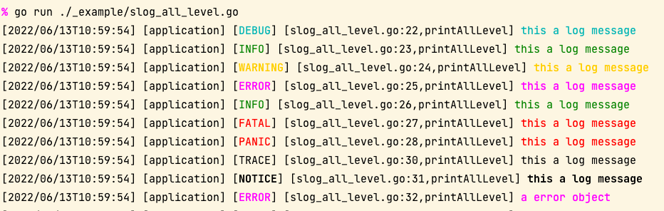
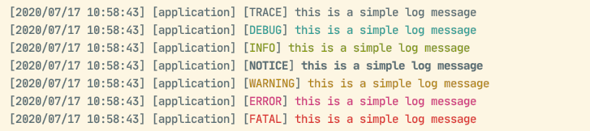
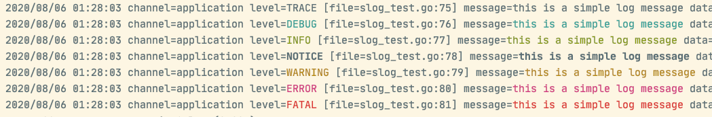

# slog


[](https://pkg.go.dev/github.com/gookit/slog)
[](https://goreportcard.com/report/github.com/gookit/slog)
[](https://github.com/gookit/slog/actions)
[](https://github.com/gookit/slog)
[](https://coveralls.io/github/gookit/slog?branch=master)

📑 Go 实现的一个易于使用的，易扩展、可配置的日志库

**控制台日志效果:**



## 功能特色

- 简单，无需配置，开箱即用
- 支持常用的日志级别处理
  - 如： `trace` `debug` `info` `notice` `warn` `error` `fatal` `panic`
- 可以任意扩展自己需要的 `Handler` `Formatter` 
- 支持同时添加多个 `Handler` 日志处理，输出日志到不同的地方
- 支持自定义构建 `Handler` 处理器
  - 内置的 `handler.Config` `handler.Builder`,可以方便快捷的构建想要的日志处理器
- 支持自定义 `Formatter` 格式化处理
  - 内置了 `json` `text` 两个日志记录格式化 `Formatter`
- 已经内置了常用的日志处理器
  - `console` 输出日志到控制台，支持色彩输出
  - `writer` 输出日志到指定的 `io.Writer`
  - `file` 输出日志到指定文件，可选启用 `buffer` 缓冲写入
  - `simple` 输出日志到指定文件，无缓冲直接写入文件
  - `rotate_file` 输出日志到指定文件，并且同时支持按时间、按大小分割文件，默认启用 `buffer` 缓冲写入
  - 更多内置实现请查看 ./handler 文件夹
- 基准性能测试请看 [Benchmarks](#benchmarks)

### 输出日志到文件

- 支持启用 `buffer` 缓冲日志写入
- 支持按时间、按大小自动分割文件
- 支持配置通过 `gzip` 压缩日志文件
- 支持清理旧日志文件 配置: `BackupNum` `BackupTime`

> NEW: `v0.3.0` 废弃原来实现的纷乱的各种handler,统一抽象为
> `FlushCloseHandler` `SyncCloseHandler` `WriteCloserHandler` `IOWriterHandler` 
> 几个支持不同类型writer的处理器。让构建自定义 Handler 更加简单，内置的handlers也基本上由它们组成。

## [English](README.md)

English instructions please see [./README](README.md)

## GoDoc

- [Godoc for github](https://pkg.go.dev/github.com/gookit/slog?tab=doc)

## 安装

```bash
go get github.com/gookit/slog
```

## 快速开始

`slog` 使用非常简单，无需任何配置即可使用。

```go
package main

import (
	"github.com/gookit/slog"
)

func main() {
	slog.Info("info log message")
	slog.Warn("warning log message")
	slog.Infof("info log %s", "message")
	slog.Debugf("debug %s", "message")
}
```

**输出预览:**

```text
[2020/07/16 12:19:33] [application] [INFO] [main.go:7] info log message  
[2020/07/16 12:19:33] [application] [WARNING] [main.go:8] warning log message  
[2020/07/16 12:19:33] [application] [INFO] [main.go:9] info log message  
[2020/07/16 12:19:33] [application] [DEBUG] [main.go:10] debug message  
```

### 启用控制台颜色

您可以在输出控制台日志时启用颜色输出，将会根据不同级别打印不同色彩。

```go
package main

import (
	"github.com/gookit/slog"
)

func main() {
	slog.Configure(func(logger *slog.SugaredLogger) {
		f := logger.Formatter.(*slog.TextFormatter)
		f.EnableColor = true
	})

	slog.Trace("this is a simple log message")
	slog.Debug("this is a simple log message")
	slog.Info("this is a simple log message")
	slog.Notice("this is a simple log message")
	slog.Warn("this is a simple log message")
	slog.Error("this is a simple log message")
	slog.Fatal("this is a simple log message")
}
```

**输出预览:**



### 更改日志输出样式

上面是更改了默认logger的 `Formatter` 设置。

> 你也可以创建自己的logger，并追加 `ConsoleHandler` 来支持打印日志到控制台：

```go
h := handler.NewConsoleHandler(slog.AllLevels)
l := slog.NewWithHandlers()

l.Trace("this is a simple log message")
l.Debug("this is a simple log message")
```

更改默认的logger日志输出样式:

```go
h.GetFormatter().(*slog.TextFormatter).SetTemplate(slog.NamedTemplate)
```

**输出预览:**



> 注意：`slog.TextFormatter` 使用模板字符串来格式化输出日志，因此新增字段输出需要同时调整模板。

### 使用JSON格式

slog 也内置了 JSON 格式的 `Formatter`。若不特别指定，默认都是使用 `TextFormatter` 格式化日志记录。

```go
package main

import (
	"github.com/gookit/slog"
)

func main() {
	// use JSON formatter
	slog.SetFormatter(slog.NewJSONFormatter())

	slog.Info("info log message")
	slog.Warn("warning log message")
	slog.WithData(slog.M{
		"key0": 134,
		"key1": "abc",
	}).Infof("info log %s", "message")

	r := slog.WithFields(slog.M{
		"category": "service",
		"IP": "127.0.0.1",
	})
	r.Infof("info %s", "message")
	r.Debugf("debug %s", "message")
}
```

**输出预览:**

```text
{"channel":"application","data":{},"datetime":"2020/07/16 13:23:33","extra":{},"level":"INFO","message":"info log message"}
{"channel":"application","data":{},"datetime":"2020/07/16 13:23:33","extra":{},"level":"WARNING","message":"warning log message"}
{"channel":"application","data":{"key0":134,"key1":"abc"},"datetime":"2020/07/16 13:23:33","extra":{},"level":"INFO","message":"info log message"}
{"IP":"127.0.0.1","category":"service","channel":"application","datetime":"2020/07/16 13:23:33","extra":{},"level":"INFO","message":"info message"}
{"IP":"127.0.0.1","category":"service","channel":"application","datetime":"2020/07/16 13:23:33","extra":{},"level":"DEBUG","message":"debug message"}
```

## 架构说明

- `Logger` - 日志调度器. 一个logger可以注册多个 `Handler`,`Processor`
- `Record` - 日志记录，每条日志就是一个 `Record` 实例。
- `Processor` - 可以对日志记录进行扩展处理。它在日志 `Record` 被 `Handler` 处理之前调用。
  - 你可以使用它对 `Record` 进行额外的操作，比如：新增字段，添加扩展信息等
- `Handler` - 日志处理器，每条日志都会经过 `Handler.Handle()` 处理。
  - 在这里你可以将日志发送到 控制台，文件，远程服务器等等。
- `Formatter` - 日志记录数据格式化处理。
  - 通常设置于 `Handler` 中，可以用于格式化日志记录，将记录转成文本，JSON等，`Handler` 再将格式化后的数据写入到指定的地方。
  - `Formatter` 不是必须的。你可以不使用它,直接在 `Handler.Handle()` 中对日志记录进行处理。

**日志调度器简易结构**：

```text
          Processors
Logger --{
          Handlers --{ With Formatter
```

> 注意：一定要记得将 `Handler`, `Processor` 添加注册到 logger 实例上，日志记录才会经过 `Handler` 处理。

### Processor 定义

`Processor` 接口定义如下:

```go
// Processor interface definition
type Processor interface {
	// Process record
	Process(record *Record)
}

// ProcessorFunc definition
type ProcessorFunc func(record *Record)

// Process record
func (fn ProcessorFunc) Process(record *Record) {
	fn(record)
}
```

> 你可以使用它在日志 `Record` 到达 `Handler` 处理之前，对Record进行额外的操作，比如：新增字段，添加扩展信息等

添加 processor 到 logger:

```go
slog.AddProcessor(mypkg.AddHostname())

// or
l := slog.New()
l.AddProcessor(mypkg.AddHostname())
```

这里使用内置的processor `slog.AddHostname` 作为示例，它可以在每条日志记录上添加新字段 `hostname`。

```go
slog.AddProcessor(slog.AddHostname())
slog.Info("message")
```

输出效果，包含新增字段 `"hostname":"InhereMac"`：

```json
{"channel":"application","level":"INFO","datetime":"2020/07/17 12:01:35","hostname":"InhereMac","data":{},"extra":{},"message":"message"}
```

### Handler 定义

`Handler` 接口定义如下:

> 你可以自定义任何想要的 `Handler`，只需要实现 `slog.Handler` 接口即可。

```go
// Handler interface definition
type Handler interface {
	io.Closer
	Flush() error
	// IsHandling Checks whether the given record will be handled by this handler.
	IsHandling(level Level) bool
	// Handle a log record.
	// all records may be passed to this method, and the handler should discard
	// those that it does not want to handle.
	Handle(*Record) error
}
```

### Formatter 定义

`Formatter` 接口定义如下:

```go
// Formatter interface
type Formatter interface {
	Format(record *Record) ([]byte, error)
}
```

函数包装类型：

```go
// FormatterFunc wrapper definition
type FormatterFunc func(r *Record) ([]byte, error)

// Format a log record
func (fn FormatterFunc) Format(r *Record) ([]byte, error) {
	return fn(r)
}
```

**JSON格式化Formatter**

```go
type JSONFormatter struct {
	// Fields exported log fields.
	Fields []string
	// Aliases for output fields. you can change export field name.
	// item: `"field" : "output name"`
	// eg: {"message": "msg"} export field will display "msg"
	Aliases StringMap
	// PrettyPrint will indent all json logs
	PrettyPrint bool
	// TimeFormat the time format layout. default is time.RFC3339
	TimeFormat string
}
```

**Text格式化formatter**

默认模板:

```go
const DefaultTemplate = "[{{datetime}}] [{{channel}}] [{{level}}] [{{caller}}] {{message}} {{data}} {{extra}}\n"
const NamedTemplate = "{{datetime}} channel={{channel}} level={{level}} [file={{caller}}] message={{message}} data={{data}}\n"
```

更改模板:

```go
myTemplate := "[{{datetime}}] [{{level}}] {{message}}"

f := slog.NewTextFormatter()
f.SetTemplate(myTemplate)
```

## 自定义日志

自定义 Processor 和 自定义 Formatter 都比较简单，实现一个对应方法即可。

### 创建自定义Logger实例

`slog.Info, slog.Warn` 等方法，使用的默认logger，并且默认输出日志到控制台。 

你可以创建一个全新的 `slog.Logger` 实例：

**方式1**：

```go
l := slog.New()
// add handlers ...
h1 := handler.NewConsoleHandler(slog.AllLevels)
l.AddHandlers(h1)
```

**方式2**：

```go
l := slog.NewWithName("myLogger")
// add handlers ...
h1 := handler.NewConsoleHandler(slog.AllLevels)
l.AddHandlers(h1)
```

**方式3**：

```go
package main

import (
	"github.com/gookit/slog"
	"github.com/gookit/slog/handler"
)

func main() {
	l := slog.NewWithHandlers(handler.NewConsoleHandler(slog.AllLevels))
	l.Info("message")
}
```

### 创建自定义 Handler

你只需要实现 `slog.Handler` 接口即可创建自定义 `Handler`。你可以通过 slog内置的
`handler.LevelsWithFormatter` `handler.LevelWithFormatter`等片段快速的组装自己的 Handler。

示例:

> 使用了 `handler.LevelsWithFormatter`， 只还需要实现 `Close, Flush, Handle` 方法即可

```go
type MyHandler struct {
	handler.LevelsWithFormatter
    Output io.Writer
}

func (h *MyHandler) Handle(r *slog.Record) error {
	// you can write log message to file or send to remote.
}

func (h *MyHandler) Flush() error {}
func (h *MyHandler) Close() error {}
```

将 `Handler` 添加到 logger即可使用:

```go
// 添加到默认 logger
slog.AddHander(&MyHandler{})

// 或者添加到自定义 logger:
l := slog.New()
l.AddHander(&MyHandler{})
```

## 使用内置处理器

[./handler](handler) 包已经内置了常用的日志 Handler，基本上可以满足绝大部分场景。

```go
// 输出日志到控制台
func NewConsoleHandler(levels []slog.Level) *ConsoleHandler
// 发送日志到email邮箱
func NewEmailHandler(from EmailOption, toAddresses []string) *EmailHandler
// 发送日志到系统的syslog
func NewSysLogHandler(priority syslog.Priority, tag string) (*SysLogHandler, error)
// 一个简单的handler实现，输出日志到给定的 io.Writer
func NewSimpleHandler(out io.Writer, level slog.Level) *SimpleHandler
```

**输出日志到文件**:

```go
// 输出日志到指定文件，默认不带缓冲
func NewFileHandler(logfile string, fns ...ConfigFn) (h *SyncCloseHandler, err error)
// 输出日志到指定文件且格式为JSON，默认不带缓冲
func JSONFileHandler(logfile string, fns ...ConfigFn) (*SyncCloseHandler, error)
// 带缓冲的输出日志到指定文件
func NewBuffFileHandler(logfile string, buffSize int, fns ...ConfigFn) (*SyncCloseHandler, error)
```

> TIP: `NewFileHandler` `JSONFileHandler` 也可以通过传入 fns `handler.WithBuffSize(buffSize)` 启用写入缓冲

**输出日志到文件并自动切割**:

```go
// 根据文件大小进行自动切割
func NewSizeRotateFile(logfile string, maxSize int, fns ...ConfigFn) (*SyncCloseHandler, error)
// 根据时间进行自动切割
func NewTimeRotateFile(logfile string, rt rotatefile.RotateTime, fns ...ConfigFn) (*SyncCloseHandler, error)
// 同时支持配置根据大小和时间进行切割, 默认设置文件大小是 20M，默认自动分割时间是 1小时(EveryHour)。
func NewRotateFileHandler(logfile string, rt rotatefile.RotateTime, fns ...ConfigFn) (*SyncCloseHandler, error)
```

> TIP: 通过传入 `fns ...ConfigFn` 可以设置更多选项，比如 日志文件保留时间, 日志写入缓冲大小等。 详细设置请看 `handler.Config` 结构体

### 输出日志到文件

输出日志到指定文件，默认不启用 `buffer` 缓冲写入。 也可以通过传入参数启用缓冲。

```go
package mypkg

import (
	"github.com/gookit/slog"
	"github.com/gookit/slog/handler"
)

func main() {
	defer slog.MustFlush()

	// DangerLevels 包含： slog.PanicLevel, slog.ErrorLevel, slog.WarnLevel
	h1 := handler.MustFileHandler("/tmp/error.log", handler.WithLogLevels(slog.DangerLevels))
	// 配置日志格式
	// f := h1.Formatter().(*slog.TextFormatter)
	f := slog.AsTextFormatter(h1.Formatter())
	f.SetTemplate("your template format\n")

	// NormalLevels 包含： slog.InfoLevel, slog.NoticeLevel, slog.DebugLevel, slog.TraceLevel
	h2 := handler.MustFileHandler("/tmp/info.log", handler.WithLogLevels(slog.NormalLevels))

	// 注册 handler 到 logger(调度器)
	slog.PushHandler(h1)
	slog.PushHandler(h2)

	// add logs
	slog.Info("info message text")
	slog.Error("error message text")
}
```

> 提示: 如果启用了写入缓冲 `buffer`，一定要在程序结束时调用 `logger.Flush()` 刷出缓冲区的内容到文件。

### 带自动切割的日志处理器

`slog/handler` 也内置了输出日志到指定文件，并且同时支持按时间、按大小分割文件，默认启用 `buffer` 缓冲写入

```go
func Example_rotateFileHandler() {
	h1 := handler.MustRotateFile("/tmp/error.log", handler.EveryHour, handler.WithLogLevels(slog.DangerLevels))
	h2 := handler.MustRotateFile("/tmp/info.log", handler.EveryHour, handler.WithLogLevels(slog.NormalLevels))

	slog.PushHandler(h1)
	slog.PushHandler(h2)

	// add logs
	slog.Info("info message")
	slog.Error("error message")
}
```

按时间切割文件示例:

```text
time-rotate-file.log
time-rotate-file.log.20201229_155753
time-rotate-file.log.20201229_155754
```

按大小进行切割的文件名示例, 格式 `filename.log.yMD_000N`. 例如:

```text
size-rotate-file.log
size-rotate-file.log.122915_00001
size-rotate-file.log.122915_00002
```

启用gzip压缩旧的日志文件:

```go
	h1 := handler.MustRotateFile("/tmp/error.log", handler.EveryHour, 
		handler.WithLogLevels(slog.DangerLevels),
		handler.WithCompress(true),
	)
```

```text
size-rotate-file.log.122915_00001.gz
size-rotate-file.log.122915_00002.gz
```

### 根据配置快速创建Handler实例

```go
// Config struct
type Config struct {
	// Logfile for write logs
	Logfile string `json:"logfile" yaml:"logfile"`
	// LevelMode 筛选日志记录的过滤级别，默认为 LevelModeList
	LevelMode uint8 `json:"level_mode" yaml:"level_mode"`
	// Level 筛选日志记录的级别值。当 LevelMode = LevelModeValue 时生效
 	Level slog.Level `json:"level" yaml:"level"`
	// Levels 日志记录的级别列表。当 LevelMode = LevelModeList 时生效
	Levels []slog.Level `json:"levels" yaml:"levels"`
	// UseJSON 是否以 JSON 格式输出日志
	UseJSON bool `json:"use_json" yaml:"use_json"`
	// BuffMode 使用的buffer缓冲模式. allow: line, bite
	BuffMode string `json:"buff_mode" yaml:"buff_mode"`
	// BuffSize 开启缓冲时的缓冲区大小，单位为字节。设置为 0 时禁用缓冲
	BuffSize int `json:"buff_size" yaml:"buff_size"`
	// RotateTime 用于按时间切割文件，单位是秒。
	RotateTime rotatefile.RotateTime `json:"rotate_time" yaml:"rotate_time"`
	// MaxSize 用于按大小旋转切割文件，单位是字节。
	MaxSize uint64 `json:"max_size" yaml:"max_size"`
	// Compress 是否对切割后的日志进行 gzip 压缩。 默认为不压缩
	Compress bool `json:"compress" yaml:"compress"`
	// BackupNum 日志清理，保留旧文件的最大数量。
	// 0 不限制，默认为 20。
	BackupNum uint `json:"backup_num" yaml:"backup_num"`
	// BackupTime 日志清理，保留旧文件的最长时间。单位是小时
	// 0 不进行清理，默认为一周。
	BackupTime uint `json:"backup_time" yaml:"backup_time"`
	// RenameFunc build filename for rotate file
	RenameFunc func(filepath string, rotateNum uint) string
}
```

**Examples**:

```go
	testFile := "testdata/error.log"

	h := handler.NewEmptyConfig(
			handler.WithLogfile(testFile),
			handler.WithBuffSize(1024*8),
			handler.WithLogLevels(slog.DangerLevels),
			handler.WithBuffMode(handler.BuffModeBite),
		).
		CreateHandler()

	l := slog.NewWithHandlers(h)
```

**BuffMode说明**

`Config.BuffMode` 使用的 BuffMode 类型名称。允许的值：line、bite

- `BuffModeLine`：按行缓冲，到达缓冲大小时，始终保证一行完整日志内容写入文件(可以避免日志内容被截断)
- `BuffModeBite`：按字节缓冲，当缓冲区的字节数达到指定的大小时，将缓冲区的内容写入文件

### 使用Builder快速创建Handler实例

使用 `handler.Builder` 可以方便快速的创建Handler实例。

```go
	testFile := "testdata/info.log"

	h := handler.NewBuilder().
		WithLogfile(testFile).
		WithLogLevels(slog.NormalLevels).
		WithBuffSize(1024*8).
		WithBuffMode(handler.BuffModeBite).
		WithRotateTime(rotatefile.Every30Min).
		WithCompress(true).
		Build()
	
	l := slog.NewWithHandlers(h)
```

## 扩展工具包

`bufwrite` 包:

- `bufwrite.BufIOWriter` 通过包装go的 `bufio.Writer` 额外实现了 `Sync(), Close()` 方法，方便使用
- `bufwrite.LineWriter` 参考go的 `bufio.Writer` 实现, 可以支持按行刷出缓冲，对于写日志文件更有用

`rotatefile` 包:

- `rotatefile.Writer` 实现对日志文件按大小和指定时间进行自动切割，同时也支持自动清理日志文件
  - `handler/rotate_file` 即是通过使用它对日志文件进行切割处理

### 在其他日志包上使用rotatefile

当然，`rotatefile.Writer` 也可以用在其他日志包上，例如：`log`、`glog` 等等。

例如，在 golang `log` 上使用 rotatefile:

```go
package main

import (
  "log"

  "github.com/gookit/slog/rotatefile"
)

func main() {
	logFile := "testdata/another_logger.log"
	writer, err := rotatefile.NewConfig(logFile).Create()
	if err != nil {
		panic(err) 
	}

	log.SetOutput(writer)
	log.Println("log message")
}
```

## 测试以及性能

### 单元测试

运行单元测试

```bash
go test -v ./...
```

### 性能压测

Benchmark code at [_example/bench_loglibs_test.go](_example/bench_loglibs_test.go)

```bash
make test-bench
```

Benchmarks for `slog` and other log packages:

> **Note**: test and record ad 2023.04.13

```shell
goos: darwin
goarch: amd64
cpu: Intel(R) Core(TM) i7-3740QM CPU @ 2.70GHz
BenchmarkZapNegative
BenchmarkZapNegative-4                   8381674              1429 ns/op             216 B/op          3 allocs/op
BenchmarkZapSugarNegative
BenchmarkZapSugarNegative-4              8655980              1383 ns/op             104 B/op          4 allocs/op
BenchmarkZeroLogNegative
BenchmarkZeroLogNegative-4              14173719               849.8 ns/op             0 B/op          0 allocs/op
BenchmarkPhusLogNegative
BenchmarkPhusLogNegative-4              27456256               451.2 ns/op             0 B/op          0 allocs/op
BenchmarkLogrusNegative
BenchmarkLogrusNegative-4                2550771              4784 ns/op             608 B/op         17 allocs/op
BenchmarkGookitSlogNegative
>>>> BenchmarkGookitSlogNegative-4            8798220              1375 ns/op             120 B/op          3 allocs/op
BenchmarkZapPositive
BenchmarkZapPositive-4                  10302483              1167 ns/op             192 B/op          1 allocs/op
BenchmarkZapSugarPositive
BenchmarkZapSugarPositive-4              3833311              3154 ns/op             344 B/op          7 allocs/op
BenchmarkZeroLogPositive
BenchmarkZeroLogPositive-4              14120524               846.7 ns/op             0 B/op          0 allocs/op
BenchmarkPhusLogPositive
BenchmarkPhusLogPositive-4              27152686               434.9 ns/op             0 B/op          0 allocs/op
BenchmarkLogrusPositive
BenchmarkLogrusPositive-4                2601892              4691 ns/op             608 B/op         17 allocs/op
BenchmarkGookitSlogPositive
>>>> BenchmarkGookitSlogPositive-4            8997104              1340 ns/op             120 B/op          3 allocs/op
PASS
ok      command-line-arguments  167.095s
```

## Gookit packages

  - [gookit/ini](https://github.com/gookit/ini) Go config management, use INI files
  - [gookit/rux](https://github.com/gookit/rux) Simple and fast request router for golang HTTP 
  - [gookit/gcli](https://github.com/gookit/gcli) Build CLI application, tool library, running CLI commands
  - [gookit/slog](https://github.com/gookit/slog) Lightweight, extensible, configurable logging library written in Go
  - [gookit/color](https://github.com/gookit/color) A command-line color library with true color support, universal API methods and Windows support
  - [gookit/event](https://github.com/gookit/event) Lightweight event manager and dispatcher implements by Go
  - [gookit/cache](https://github.com/gookit/cache) Generic cache use and cache manager for golang. support File, Memory, Redis, Memcached.
  - [gookit/config](https://github.com/gookit/config) Go config management. support JSON, YAML, TOML, INI, HCL, ENV and Flags
  - [gookit/filter](https://github.com/gookit/filter) Provide filtering, sanitizing, and conversion of golang data
  - [gookit/validate](https://github.com/gookit/validate) Use for data validation and filtering. support Map, Struct, Form data
  - [gookit/goutil](https://github.com/gookit/goutil) Some utils for the Go: string, array/slice, map, format, cli, env, filesystem, test and more
  - More, please see https://github.com/gookit

## Acknowledgment

实现参考了以下项目，非常感谢它们

- https://github.com/phuslu/log
- https://github.com/golang/glog
- https://github.com/sirupsen/logrus
- https://github.com/Seldaek/monolog
- https://github.com/syyongx/llog
- https://github.com/uber-go/zap
- https://github.com/rs/zerolog
- https://github.com/natefinch/lumberjack

## LICENSE

[MIT](LICENSE)
