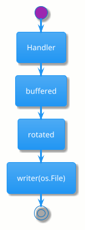

# Handlers

```text
handler -> buffered -> rotated -> writer(os.File)
```


```plantuml
@startuml

!theme materia
skinparam backgroundColor #fefefc

start

:Handler;
:buffered;
:rotated;
:writer(os.File);
stop

@enduml
```
